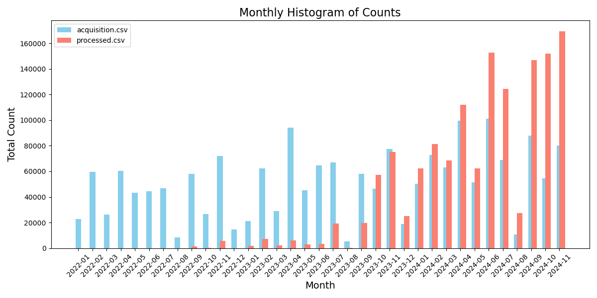

## Attendance

Attendees:

- Rolf Krahl
- Louise Davies
- Kirsty Syder
- Marjolaine Bodin
- Kevin Phipps
- Alex de Maria
- Patrick Austin

## Agenda

## Site Updates

### HZB

Nothing to report

Working on sample database. Connected to ICAT but not in ICAT. Separate instance but closely tied to ICAT. Developing. Still issue in ICAT that [Investigation <-> Sample relation is 1 to many](https://repo.icatproject.org/site/icat/server/6.0.0/schema.html#Sample). [Need many to many](https://github.com/icatproject/icat.server/issues/231). This is incompatible with our usecase, so will become urgent at some point.

Alex: What is scope of Sample Database.
Rolf: Link all the Datasets that are related to that Sample. Notebooks. Idea is that there is little hope that some Sample describing schema. Rather, to have information about the sample need to tie the history of the sample creation, characterisation, measurement and other things. For this, one identifier, and manage it. Once you have that, you can mint ... identfiers for the Sample. Do nice things.
Alex: Also interested in extending the metadata of the Sample. Once it is created, there is a lot of information but it does not come to the Facility. Should be prepared before doing the experiment. This is tricky.
Rolf: Hard to get users to do it, but giving the possibility to do it would be the first step . Home institute could register, and use an existing identifier from their home institue, that is the first step. Depends on user communities and home facilities. Maybe they have something there that they can point to the logbooks that they have. Idea is to have the basic infrastuture in place that links to other things. Ideally the logbook from sample creation.
Alex: How do you think we motivate them to do that? Most of the time the users do not care.
Rolf: Aware that this is the tricky part. Very nice things that you need to do, first is make it possible. Next is to... multiple approaches, e.g. make it rewarding. If users are interested they should have the means to do so. Aware this catches only the minority.
Alex: Fear that even if possible you will have around 0 Samples declared. They will not do it.
Rolf: Anticipate that a wide variation of user behaviour. Projects like the rock IT project. Where that they will do that. Discussing in the DAPHNE project. Few, but they will make use of that. Once these users see a benefit, and others see it makes sense, others will follow. Have quite some in house research users, have a much closer relation to them and discuss workflows. They will be an easier catch. Can integrate the whole thing in their lab workflows. Pretty well aware it will not be adopted by all immediately. If you are interested can present it and seee what you think. At the moment in development phase. Similar approach to ICAT+ but in a different direction. Using Postgresql, more than can be captured in Parameters. Every entry in Sample Database corresponds. Two reasons: linking datasets and don't want to re-implement auth - use ICAT for that. Users need ICAT sessionIds. Will get to see everyhting that ICAT lets them, using the Rule system.

### ESRF

Last week, ISPYB collab meeting. Interest in some facilities in running SciCAT. Invited SciCAT to talk about their roadmap, to catch up to ICAT features their roadmap takes them to 2029.

Number of datasets (especially processed). 3x more processed than raw. Too many processed data in the ingest queue, takes hours for data to be ingested & seen in portal. Need to increase number of ingesters
Kevin: is your ingestion single threaded?
Alex: no, multi-threaded. However, not touched in 10 years. Should probably rethink. However, can scale easily by adding more machines, but limit is datafiles in DB.
~1500 Datasets an hour, think can scale by a factor of ~2-3.

Kevin: SciCAT road map is to get to base ICAT or ICAT+ (& DataPortal)?
ISpyb roadmap - 5 years is to get to the ICAT+/Ipsyb functionality. Needs to include sample tracking, visualisations. A lot of non-core/OOTB ICAT functionality.

Presentations:
Scicat by Max Novelli:
<https://indico.elettra.eu/event/47/contributions/1002/attachments/257/648/MXCuBE_ISPyB_Trieste_20241120.pdf>

Scicat roadmap by Alberto (MAXIV):
<https://indico.elettra.eu/event/47/contributions/852/attachments/231/615/MAXIV%20ISPyB%20Meeting%20Elettra%202024%20-%20Future.pdf>

ESRF:
<https://indico.elettra.eu/event/47/contributions/1001/attachments/237/622/ISPyB_MXCube%20Nov%202024%20ELETTRA%20ESRF.pdf>

All presentations:
<https://indico.elettra.eu/event/47/sessions/223/#20241120>



### ISIS

Louise: Santosh on leave. Same as last time. Security updates, Payara migration stuff.

### DLS

Had meeting with users for quick wins with DataGateway. 2 main things - single visit download. Single visit is fairly easy as long as restricted to DLS users.

Patrick: current plan to change datagateway-download-api (was the TopCAT backend) and nothing else (at least at first). Minimal DataGateway (UI) changes. Introduce a queue and queue up visit restore jobs when low loads.
Rolf: Would have a separate component.
Patrick: it's going in the place it's easiest to put it. dg-download-api is centralised, DLS in particular has multiple IDSes so dg-dl-api is the central part.

## Component Updates

### icat.server

Alan is still working on work to containerise & modernisation but still ongoing

Alex: modTime? Can't be modified ourselves
Kevin: every entity has it, part of entity base class.
Louise: used for audit info
Louise: note, Datafile has datafileModTime etc. which is separate to modTime
Rolf: yeah datafileModTime is for the file metadata

Alex: yes, in UI want to sort by most recent Sample. Sort by modTime. Also want to sort by raw dataset modTime.
Rolf: Unsure if sorting is a good idea. E.g. database updates, would update all the modTimes.
Patrick: e.g. schema updates would affect things?
Rolf: should rely on startDate/endDate of Dataset.
Alex: problem is it's on the Sample.
Patrick: Could have a sample parameter?
Alex: yes, it's slower... Just need to be careful with modifying the modTime
Louise: It's only a UX thing, so maybe not a concern that the ordering gets wiped?
Alex: but with 1000s of datasets, might never find the most "recent" if ordering is wrong

Louise: Maybe misremembering - pending schema changes?
Rolf: Yes, originally planned by the end of the year. Suppose it is not realistic. We just need to do that.

### ids.server

Nothing

Alex: we've changed our fork. Created new endpoint. Gets the real location where the datafile is. Location in ICAT is location it was generated. We have multiple restore locations. ISPYB it's useful to know where the file currently is. So created a new endpoint.
Rolf: it depends on your plugin. Plugin processes the location attribute, and determines how to access that file.
Alex: current IDS endpoint tells you the status (e.g. ONLINE), but not the location. So that's what new endpoint does.
Rolf: IDS doesn't know where the location is
Alex: our IDS plugin knows where to find the file
Rolf: exactly, the plugin knows not the IDS
Alex: Have implemented new endpoint that requests the plugin where it actually is. Goes to the plugin and asks. Plugin responds with the current location of the file or Dataset.
K: To do that, do you just have N locations on disk and look for them and if not their on tape? It can't look in ICAT because it [the information] is not there.
Alex: Yes, exactly. For datafile id, if I get an empty array, it's archived. Otherwise, array with locations (it can be in multiple locations).
Rolf: TBH still a bit puzzled. Meaning of the location is only something the plugin knows. IDS has no clue.
Alex: When you mean location you mean column of the Datafile. We say this is just an identifier. What this endpoint retrieves is the absolute path.
Rolf: You put meaning into that. It has something to
Patrick: it's not dealing with the df location. Give a datafile ID, and get the physical path.
Alex: yes.
Rolf: Standard ids queries DB for all the information, gives location to the plugin and makes sesne of it.
Patrick: apply same logic as normal IDS, pass info to plugin, plugin applies its internal login and returns the physical path 

Alex showed an example of the config

Alex: Key point: there are 3 possible locations, e.g. a Globus for public data. Emborgoed data that belongs to the user goes somewhere else. Depending on the kind it may end up in muleiple areas (and therefore, have multiple physical paths)
Louise: Diamond also has multiple things, but is done in different ways.
Kevin: Similar problem, there are three places where Diamond's data could be. Would be nice to (if it exists on disk) move it between disk ednpoinds as we always go to tape. IDS per restore mechanism. Can push to Globus, or DLS, but once it's there we can't go get it. Maybe we could do something similar.

Alex: No magic - instead of "isOnline" just return that path.

Kevin: Are all these filesystems mounted? We don't have this. Some are in DLS and some are in SCD. We could benefit from something like this. 

Example of the query:

```text
https://ids.esrf.fr/ids/path?sessionId=XXX&datasetIds=187132537&isonline=True

["/data/id10b/inhouse/user17.2/scoppola/data"]
```

and:

```text
https://ids.esrf.fr/ids/path?sessionId=XXXX&datasetIds=187132537

["/data/visitor/sc4680/id10/restored_dataset/_datasetId_187132537","/data/projects/open-datasets/sc4680/id10/Phospholipidic bilayer at fluorocarbon oil - water interface_High energy X-ray reflectivity at lqiuid-liquid interface","/data/projects/open-datasets/data/id10b/inhouse/user172/scoppola/data","/data/icat/main/187132537"]
```

### python-icat

Another release in December. Minor addition. Custom method for restoring data from IDS. Triggers a restore & waits for the restore to complete.

## AOB

### December meeting

Cancel it, Kevin to set up meeting series for next year.
